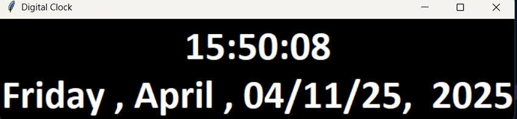
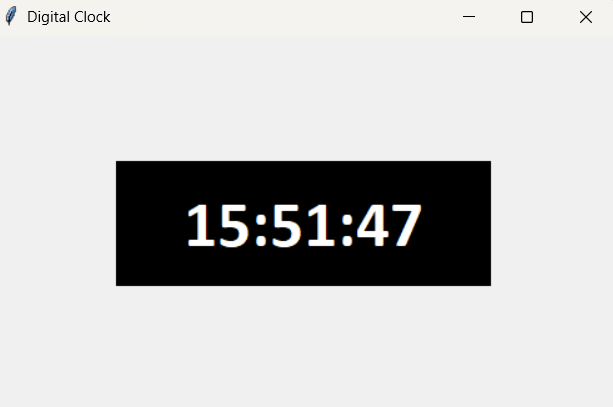

🕒 Digital Clock using Tkinter
This is a simple Digital Clock application built using Python's tkinter library. The clock updates in real-time and displays the current time in HH:MM:SS format.

📸 Screenshot
(Add a screenshot here if you'd like — optional)

✅ Features
Displays the current hour, minute, and second.

Automatically updates every second.

Clean and minimal UI using Tkinter.

Customizable window size and fonts.

🛠️ Technologies Used
Python

Tkinter (Python standard GUI library)
time module

💡 Customization Ideas
Show current date and day.

Add light/dark mode toggle.

Change font styles or background color.

Convert to an analog clock design.

